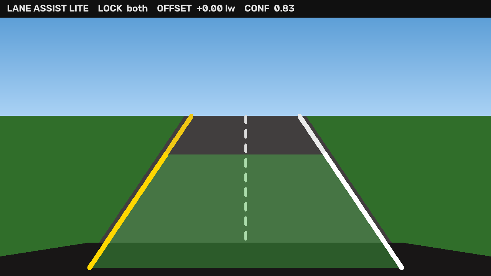
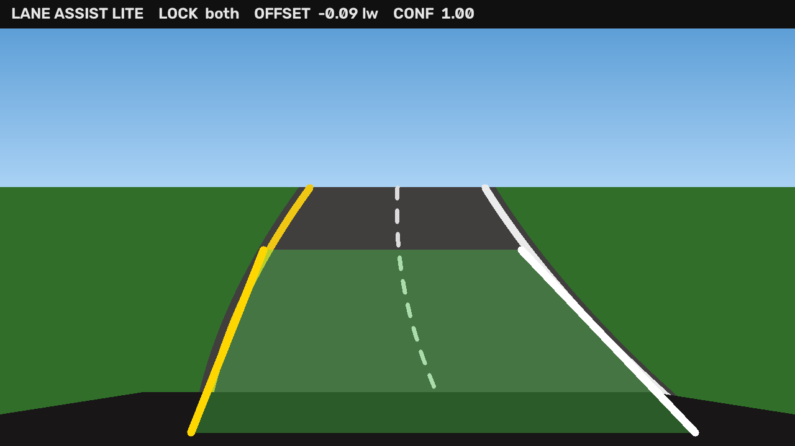
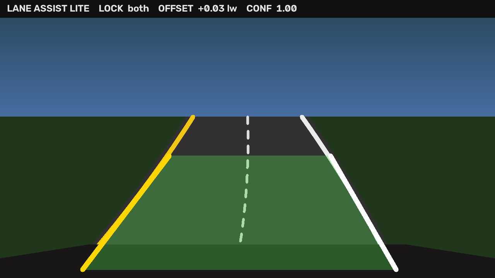

# Lane Assist Lite

Classical computer-vision **lane detection** for a forward-facing camera.
A weekend-scale perception demo by **Gyan Mistry** ([misty6g](https://github.com/misty6g)) —
the kind of camera → geometry → state pipeline that shows up in vehicle
software and Autopilot-adjacent internship work.

This is **not** a neural net and not a driving policy. It finds left/right
lane markings, estimates lateral offset in the image plane, and overlays a
lane corridor on images or short clips.



<p align="center">
  
  
</p>

## What it does

1. **Condition** the frame (blur, Canny edges, yellow/white HLS prior)
2. **Crop** to a roadway trapezoid (ignore sky and hood)
3. **Extract** line segments with a probabilistic Hough transform
4. **Fit** left vs. right markings (`y = mx + b`, extrapolated through the ROI)
5. **Estimate** lane-center offset at the near field (positive = right of center)
6. **Smooth** coefficients across video frames with an exponential moving average
7. **Overlay** a filled corridor, painted markings, and a small HUD

```
frame → blur / Canny / color prior → ROI
     → HoughLinesP → left/right buckets → slope-intercept fit
     → (video) EMA → offset + confidence → overlay + JSON report
```

## Quick start

Python 3.10+ (CPU only — no GPU).

```bash
python -m venv .venv
source .venv/bin/activate          # Windows: .venv\Scripts\activate
pip install -e ".[dev]"
```

Annotate a bundled still, or the short weave clip:

```bash
python -m lane_assist run data/samples/straight.png -o output/straight_annotated.png
python -m lane_assist run data/samples/clip.mp4 -o output/clip_annotated.mp4
```

Equivalent console script after install: `lane-assist run …`.

The image command prints a JSON estimate:

```json
{
  "output": "output/straight_annotated.png",
  "left": [233, 698, 432, 403],
  "right": [1047, 698, 848, 403],
  "center_offset_px": 0.09,
  "offset_lane_widths": 0.000,
  "confidence": 0.83
}
```

Regenerate the synthetic demo set (nothing here is scraped dashcam footage):

```bash
python -m lane_assist generate -o data/samples
```

## Tests

```bash
pytest
```

CI (`.github/workflows/ci.yml`) runs the same suite on Python 3.11 and 3.12
with `opencv-python-headless`. Geometry and helper tests do not need a display
or a GPU.

## Layout

```
src/lane_assist/     pipeline, geometry, preprocess, detect, overlay, CLI
tests/               pytest for geometry, preprocess, detect, pipeline, CLI
data/samples/        synthetic stills + short clip (see data/samples/README.md)
assets/              annotated stills used in this README
```

## Design notes

- **Offset sign:** `image_center − lane_center` at the bottom of the ROI.
  Positive means the camera (vehicle) is **right** of the lane center.
- **Why classical CV:** a readable baseline before learned detectors. Easy to
  unit-test, easy to explain in an interview, and close to the first-generation
  lane-keep stacks that still inform production perception.
- **Limits:** no bird’s-eye warp, no learned features, no control loop. Heavy
  weather, worn paint, and tight urban curvature will drop lock. That is
  expected for this scope.

## License

MIT © 2026 Gyan Mistry
